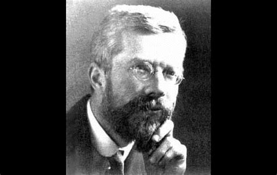

# HMRI Research Design and Statistical Services {data-background-image="creditss.jpg" data-background-opacity=0.4}

# Biostatistics

" To call a biostatistician after the experiment is done may be no more than
asking him to perform a post mortem examination: he may be able to say what the
experiment died of"
- Ronald Fisher

# Common causes of study deaths {data-background-color="rgb(70, 70, 255)"}

## Incorrect Study Design
- Selection bias
- Contamination and clustering
- Randomisation
- Pilot studies

## Failure to consider / measure confounding variables

- Stratify or adjust
- Causal modelling

## Insufficient sample size

- Depends on:
    - Outcome types and study design
    - Clinically relevant difference
    - Variability in the data
    - Power and Type 1 error

## Using excel to collect the data

 
 simple survey through to RCT
 free, easy-to-use, secure, ICH-GCP compliant

## Failure to pre-specify an analysis plan

- increasingly a requirement to publish

# How else can we help

## Visualisations and dashboards
- Interactive dashboards using real time data
- Display recruitment rates, missing data, subject dispositions

## More than just point and click

- understanding the different options
- how to check if the results make sense
- what to do if they dont

## Reproducibility
- self contained code that will
    - clean data and create analysis datasets 
    - run all analysis
    - produce the tables and graphs
    - integrated into the report
- eliminates transcription errors
- ensures results reproducible in 5, 10 years

## How to contact us
- https://redcap.link/creditssservicerequest

